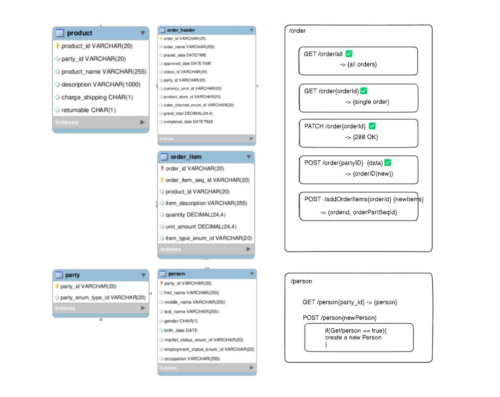
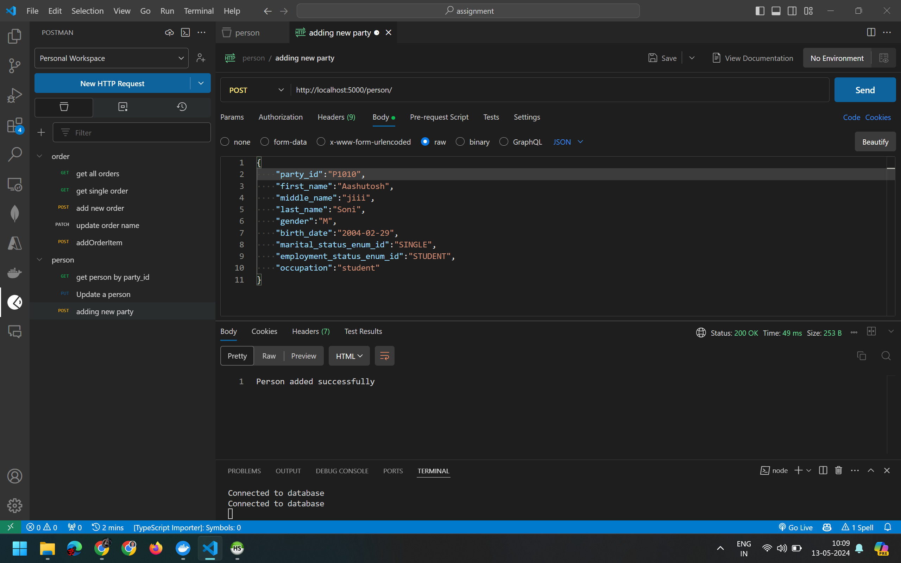
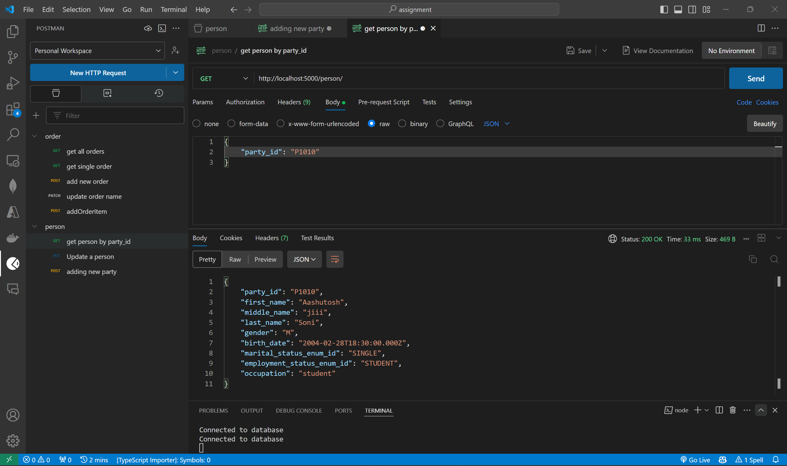
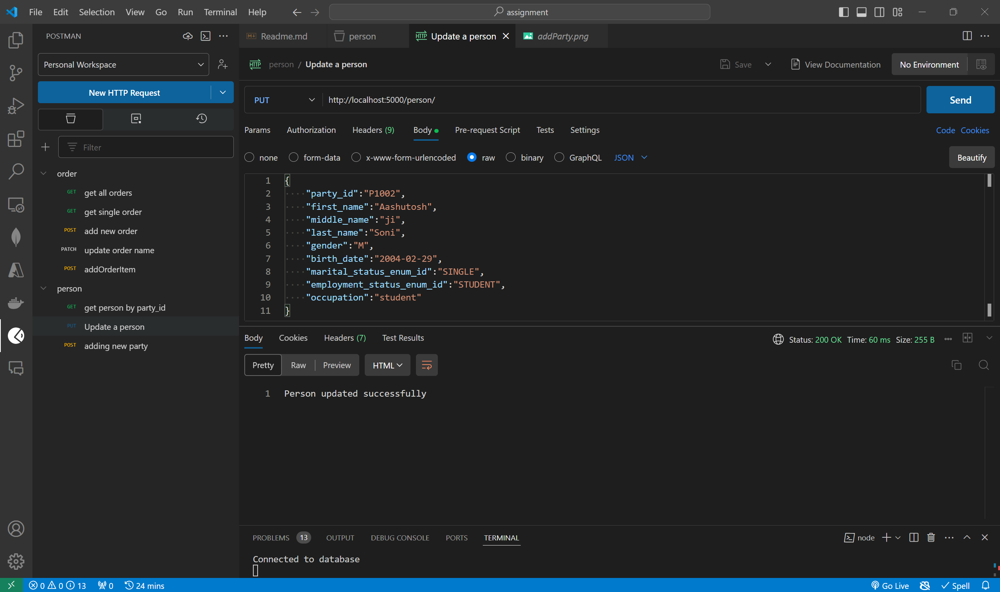
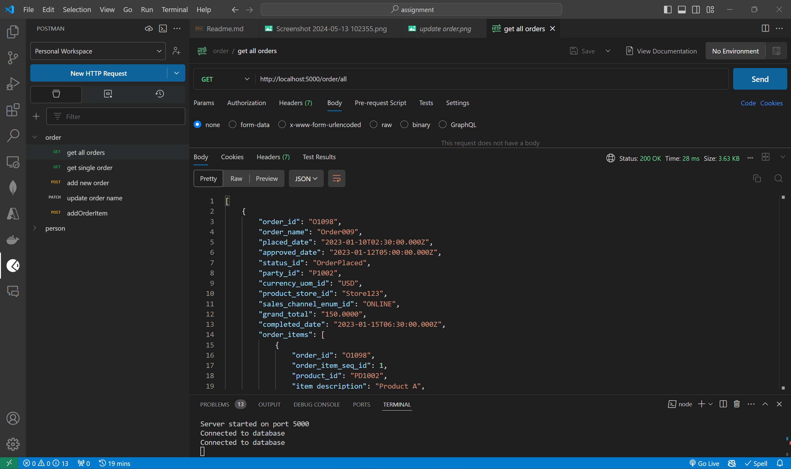
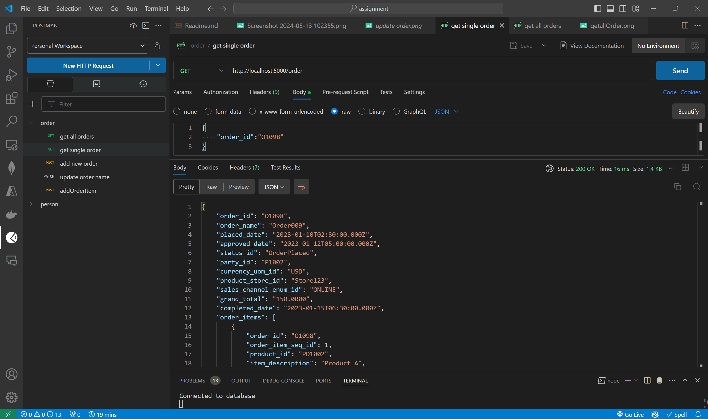
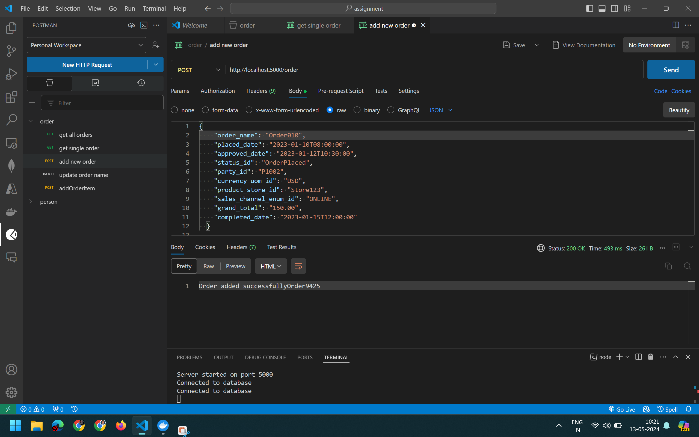
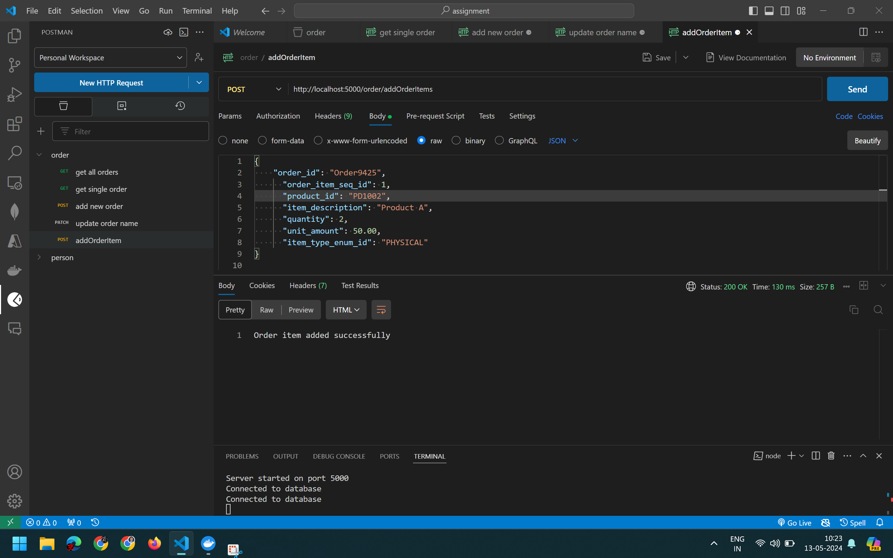
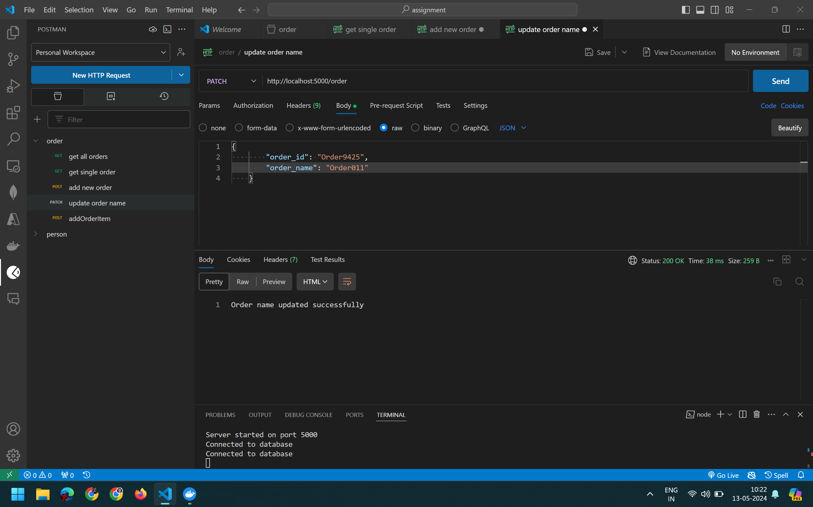

# Hotwax Assignment [](https://wakatime.com/badge/user/62850a07-caf8-470f-86a7-660093b4f5b4/project/7a51eeec-017c-4971-967c-0b3a6d484115)

This repository contains the assignment for Hotwax. The assignment involves creating a database using MySQL and developing REST APIs for it.

## Progress

1. I created a MySQL database using Docker.
2. Created the necessary tables in the database.
3. Inserted sample data into the tables.
4. Started developing REST APIs.

## Steps to Setup the Database

1. Pull the MySQL Docker image:
   ```
   docker pull mysql
   ```
2. Start the Docker container:
   ```
   docker run --name my-mysql -e MYSQL_ROOT_PASSWORD=password -p 3306:3306 -d mysql
   ```
3. Connect to MySQL using a GUI client with the username `root` and password `password`.
4. Create a new database:
   ```
   CREATE DATABASE hotwax;
   USE hotwax;
   ```

## Database Schema

1. `party` table:

   ```sql
   CREATE TABLE party (
       party_id VARCHAR(20) NOT NULL,
       party_enum_type_id VARCHAR(20) DEFAULT NULL,
       PRIMARY KEY (party_id)
   );
   ```

2. `product` table:

   ```sql
   CREATE TABLE product (
       product_id VARCHAR(20) NOT NULL,
       party_id VARCHAR(20) DEFAULT NULL,
       product_name VARCHAR(255) DEFAULT NULL,
       description VARCHAR(1000) DEFAULT NULL,
       charge_shipping CHAR(1) DEFAULT NULL,
       returnable CHAR(1) DEFAULT NULL,
       PRIMARY KEY (product_id),
       CONSTRAINT product_owner_fk FOREIGN KEY (party_id) REFERENCES party(party_id)
   );
   ```

3. `order_header` table:

   ```sql
   CREATE TABLE order_header (
       order_id VARCHAR(20) NOT NULL,
       order_name VARCHAR(255) DEFAULT NULL,
       placed_date DATETIME DEFAULT NULL,
       approved_date DATETIME DEFAULT NULL,
       status_id VARCHAR(20) DEFAULT NULL,
       party_id VARCHAR(20) DEFAULT NULL,
       currency_uom_id VARCHAR(20) DEFAULT NULL,
       product_store_id VARCHAR(20) DEFAULT NULL,
       sales_channel_enum_id VARCHAR(20) DEFAULT NULL,
       grand_total DECIMAL(24,4) DEFAULT NULL,
       completed_date DATETIME DEFAULT NULL,
       PRIMARY KEY (order_id),
       CONSTRAINT order_customer_fk FOREIGN KEY (party_id) REFERENCES party(party_id)
   );
   ```

4. `order_item` table:

   ```sql
   CREATE TABLE order_item (
       order_id VARCHAR(20) NOT NULL,
       order_item_seq_id VARCHAR(20) NOT NULL,
       product_id VARCHAR(20) DEFAULT NULL,
       item_description VARCHAR(255) DEFAULT NULL,
       quantity DECIMAL(24,4) DEFAULT NULL,
       unit_amount DECIMAL(24,4) DEFAULT NULL,
       item_type_enum_id VARCHAR(20) DEFAULT NULL,
       PRIMARY KEY (order_id, order_item_seq_id),
       CONSTRAINT order_item_order_fk FOREIGN KEY (order_id) REFERENCES order_header(order_id),
       CONSTRAINT order_item_product_fk FOREIGN KEY (product_id) REFERENCES product(product_id)
   );
   ```

5. `person` table:
   ```sql
   CREATE TABLE person (
       party_id VARCHAR(20) NOT NULL,
       first_name VARCHAR(255) DEFAULT NULL,
       middle_name VARCHAR(255) DEFAULT NULL,
       last_name VARCHAR(255) DEFAULT NULL,
       gender CHAR(1) DEFAULT NULL,
       birth_date DATE DEFAULT NULL,
       marital_status_enum_id VARCHAR(20) DEFAULT NULL,
       employment_status_enum_id VARCHAR(20) DEFAULT NULL,
       occupation VARCHAR(255) DEFAULT NULL,
       PRIMARY KEY (party_id),
       CONSTRAINT person_ibfk_1 FOREIGN KEY (party_id) REFERENCES party(party_id)
   );
   ```

## Sample Data

Sample data for the `party`, `person`, and `product` tables

sample party data-

```
INSERT INTO party (party_id, party_enum_type_id) VALUES ('P1000', 'PERSON');
INSERT INTO party (party_id, party_enum_type_id) VALUES ('P1001', 'PERSON');
INSERT INTO party (party_id, party_enum_type_id) VALUES ('P1002', 'PERSON');
```

sample data person table-

```
INSERT INTO person (party_id, first_name, middle_name, last_name, gender, birth_date, marital_status_enum_id, employment_status_enum_id, occupation) VALUES ('P1001', 'Alice', 'Marie', 'Smith', 'F', '1995-08-20', 'SINGLE', 'EMPLOYED', 'Data Scientist');
INSERT INTO person (party_id, first_name, middle_name, last_name, gender, birth_date, marital_status_enum_id, employment_status_enum_id, occupation) VALUES ('P1002', 'Joe', 'D', 'Jackson', 'M', '1998-08-23', 'SINGLE', 'EMPLOYED', 'Data Scientist');
```

sample data product table-

```
INSERT INTO product (product_id, party_id, product_name, description, charge_shipping, returnable) VALUES ('PD1001', 'P1001', 'Smartphone X', 'High-end smartphone with advanced features', 'Y', 'Y');
INSERT INTO product (product_id, party_id, product_name, description, charge_shipping, returnable) VALUES ('PD1002', 'P1002', 'Laptop Pro', 'Powerful laptop for professional use', 'Y', 'Y');
INSERT INTO product (product_id, party_id, product_name, description, charge_shipping, returnable) VALUES ('PD1003', 'P1003', 'Mac Book', 'High-end device with advanced features', 'Y', 'N');
```

## REST APIs

Basic LLD-


## Outputs-

Party-

1. Add a Party-
   
2. Get a Party-
   
3. Update Party-
   

Order-

1. Get all Orders-
   

2. Get Single Order-
   

3. Add new order-
   

4. Add order items-
   

5. Update order-
   

## Suggestions by ayan

1. order_id issue -> done
2. why primary key, why ... ->
3. don't use js, use Join for querying data from multiple tables ->
